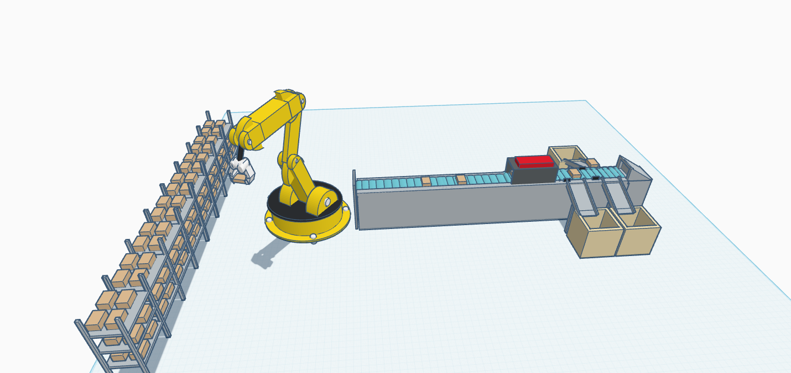

# Mechanical Task 2 – Automated Warehouse Robot

## 📝 Description
This project involves designing a robotic system to automate a food storage warehouse with no human interaction. The robot features a mechanical arm and conveyor belt system to move packages between storage racks and sorting stations.

The system is designed to operate fully autonomously — once powered on, it continues performing its tasks without any manual input.

---

## ⚙️ Objective
- Transform a manual food warehouse into a fully automated system.
- Design a robot capable of picking, transferring, and sorting boxes.
- Ensure the robot can operate continuously without human assistance.

---

## 🧱 Components
- Robotic Arm (5 DOF)
- Conveyor Belt System
- Storage Racks
- Boxes (Packages)
- Sorting Containers

---

## 🤖 Execution Algorithm
1. The system starts automatically once powered.
2. The robot receives a start command from its internal controller.
3. The robotic arm picks up a box from the storage rack.
4. Transfers it to the conveyor belt.
5. The belt moves the box to the sorting area.
6. The process repeats automatically without any human interaction.

---

## 🔄 Working Envelope
- 5 Degrees of Freedom (DOF):
  - Base rotation
  - Vertical lift
  - Horizontal extension
  - Wrist rotation
  - Gripper open/close
- Full movement coverage of shelves and conveyor area.

---

## 📂 Files Included
- Mechanical-AutomatedWarehouse.stl – 3D Design File
- AutomatedWarehouse-screenshot.png – Screenshot of the robotic design

---

> ⚡️ Fully automated warehouse solution – designed to optimize logistics operations efficiently.
